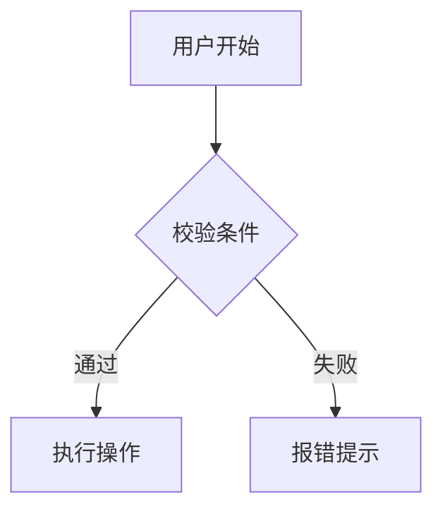
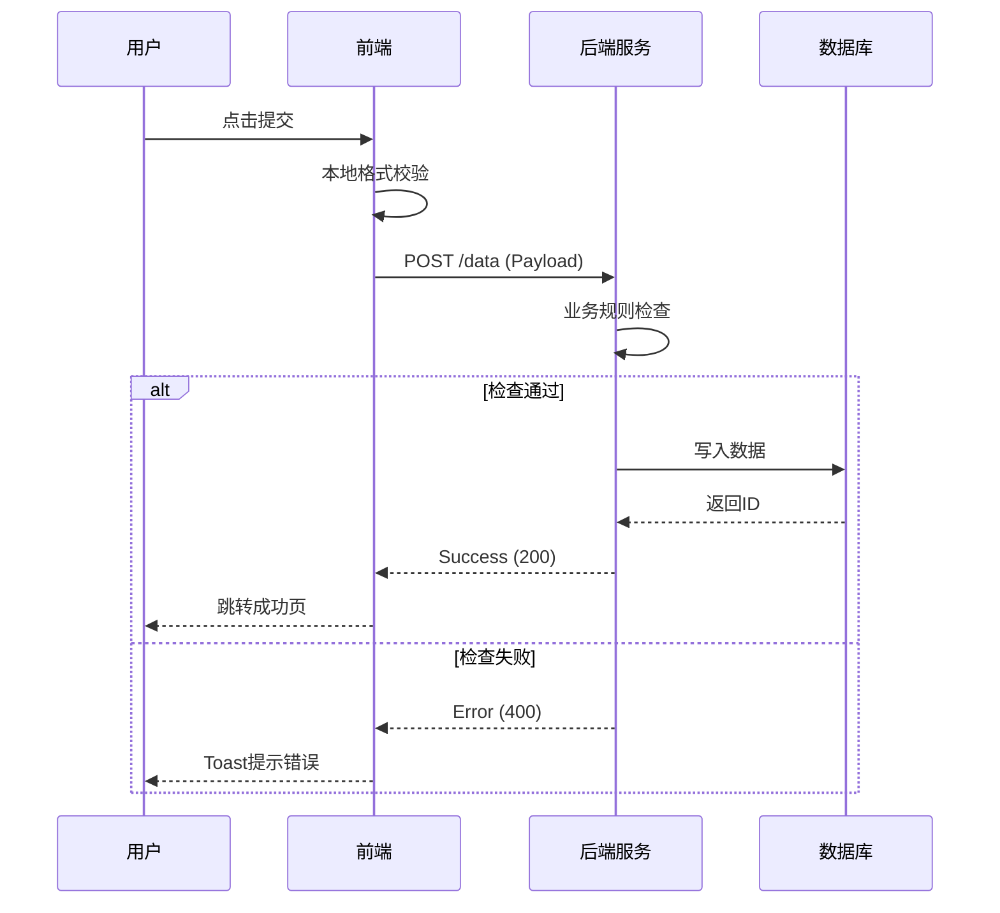
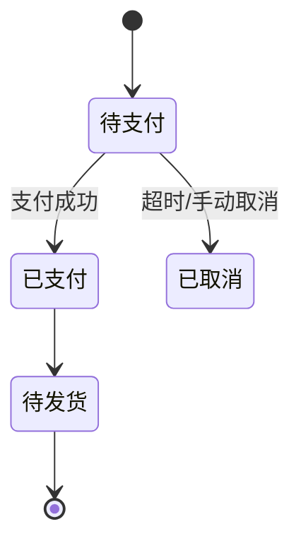

# PRD Generator

这个技能是你的全能产品文档助手。它不仅帮助你撰写文档，更帮助你梳理产品逻辑、定义成功指标、设计数据埋点，并以开发和测试人员能理解的语言输出高质量PRD。

## When to Use This Skill

- **从0到1**: 将模糊的想法转化为可执行的规格说明书
- **功能迭代**: 设计新特性，确保逻辑闭环
- **逻辑梳理**: 需要画复杂的业务流程图、状态机或时序图
- **文档评审**: 需要模拟开发、测试或设计视角对PRD进行查漏补缺
- **标准化**: 统一团队的PRD格式，包含埋点和权限定义

## What This Skill Does

1.  **深度信息架构**: 引导梳理业务目标、用户场景及核心指标
2.  **专业图表生成**: 自动生成流程图(Flowchart)、时序图(Sequence)、状态图(State)
3.  **多视角评审**: 模拟 Dev/QA/UI 角色对需求进行"攻击性"测试
4.  **数据与权限**: 自动生成数据埋点需求表和角色权限矩阵
5.  **竞品深度拆解**: 从功能、体验到商业模式的多维分析
6.  **标准化输出**: 生成结构清晰、研发友好的Markdown文档

## How to Use

### 初始化工作区

```bash
mkdir prd
cd prd
# 创建主索引文件
touch prd-master.md
```

### 常用指令

1.  **启动项目**:
    > "帮我创建一份PRD，产品是[简要描述]，核心目标是[目标]"

2.  **深度设计功能**:
    > "帮我设计[功能名]的逻辑，需要包含数据埋点和异常流程"

3.  **绘制逻辑图**:
    > "帮我画一下[功能]的状态流转图" 或 "画一下前端与后端的交互时序图"

4.  **角色化评审**:
    > "请作为**资深后端开发**Review这个模块，指出逻辑漏洞"
    > "请作为**QA测试**Review这个模块，指出验收标准是否清晰"

5.  **生成完整文档**:
    > "整合所有内容，生成最终的PRD文档"

## Instructions

### 1. 结构化引导 (The Outline)

协助用户建立包含商业价值和技术实现的完整大纲：

```markdown
# PRD大纲: [产品名称]

## 1. 全局概览
- [ ] 产品背景与价值
- [ ] **核心成功指标 (North Star & KPIs)**
- [ ] 目标用户画像
- [ ] 竞品分析 (差异化策略)

## 2. 全局规则
- [ ] **角色与权限矩阵 (Permission Matrix)**
- [ ] 全局交互规范
- [ ] 通用异常处理

## 3. 功能需求 (按模块)
- [ ] 模块A: [名称]
  - 业务流程图 (Flowchart)
  - 详细逻辑与规则
  - **数据埋点需求 (Analytics)**
  - 状态流转 (State Diagram)
- [ ] 模块B: [名称]

## 4. 非功能需求
- [ ] 性能与并发要求
- [ ] 数据安全与隐私
- [ ] 兼容性要求

## 5. 待确认事项 (TBD)
```

### 2. 竞品研究 (Competitor Research)

除了功能对比，增加**技术实现猜测**和**商业策略**分析：

```markdown
### 竞品对比总结

| 维度 | 竞品A | 竞品B | 我们的策略 |
|------|-------|-------|------------|
| **核心功能** | [描述] | [描述] | [差异化点] |
| **交互体验** | [优/劣] | [优/劣] | [改进方案] |
| **商业变现** | [模式] | [模式] | [模式] |
| **技术壁垒** | [推测] | [推测] | [对策] |
```

### 3. 高级图表生成 (Advanced Diagrams)

根据场景选择最合适的 Mermaid 图表类型：

**场景 A: 业务流程 (Flowchart)**


**场景 B: 数据交互/API逻辑 (Sequence Diagram)**
*适用于需要说明前后端交互、第三方接口调用的场景*


**场景 C: 对象生命周期 (State Diagram)**
*适用于订单状态、审核流等*


### 4. 深度模块设计 (Detailed Design)

在编写功能模块时，必须包含**埋点**和**权限**：

```markdown
#### 4.1 [功能名称]

**A. 功能描述**
[简述功能及其价值]

**B. 验收标准 (AC)**
1. [条件1]
2. [条件2]

**C. 数据埋点**
| 事件ID | 事件名称 | 触发时机 | 参数 (Params) |
|--------|----------|----------|---------------|
| `click_submit` | 点击提交 | 用户点击提交按钮时 | `user_id`, `form_type` |

**D. 异常流程**
| 异常场景 | 前端表现 | 后端处理 |
|----------|----------|----------|
| 网络超时 | 显示重试按钮 | 幂等性校验 |
| 数据冲突 | 提示"数据已更新" | 返回最新数据 |
```

### 5. 角色化反馈 (Role-Based Review)

在用户完成模块撰写后，提供不同视角的反馈：

**指令**: "帮我 Review 这个模块"

**响应逻辑**:

1.  **👀 产品视角 (PM)**:
    - 商业价值是否清晰？
    - 用户路径是否闭环？

2.  **💻 开发视角 (Dev)**:
    - **数据结构**: "这里的状态流转是否漏了'退款中'的状态？"
    - **边界条件**: "列表为空时显示什么？数据量超过1000条怎么分页？"
    - **一致性**: "前端校验规则是否与后端数据库约束一致？"

3.  **🧪 测试视角 (QA)**:
    - **可测性**: "这个'响应迅速'不够具体，请量化为'小于200ms'。"
    - **前置条件**: "测试此功能需要什么样的账号权限？"

### 6. 最终文档生成

整合生成标准文档，并建议添加**修订历史**和**名词解释**。

```markdown
# [产品名称] 产品需求文档 (PRD)

## 文档控制
| 版本 | 日期 | 修改人 | 修改内容 |
|------|------|--------|----------|
| v1.0 | 2024-x-x | [Name] | 初稿建立 |

## 1. 核心指标 (Metrics)
[定义北极星指标和辅助指标]

## 2. 权限矩阵 (Permissions)
| 角色 | 查看 | 编辑 | 删除 | 审核 |
|------|------|------|------|------|
| 普通用户 | ✅ | ❌ | ❌ | ❌ |
| 管理员 | ✅ | ✅ | ✅ | ❌ |

... [后续接具体功能模块]
```

## Review Checklist (For Final Output)

在输出最终文档前，自动检查：

- [ ] **逻辑闭环**: 所有流程图都有“结束”节点，所有判断都有“是/否”分支。
- [ ] **状态完整**: 状态机图包含了所有可能的流转路径。
- [ ] **指标明确**: 避免使用“快速”、“流畅”等形容词，使用具体数值。
- [ ] **异常覆盖**: 断网、报错、空状态、极限数据量是否已定义。
- [ ] **埋点对应**: 核心业务动作是否有对应的埋点定义。

## Pro Tips

1.  **时序图是沟通神器**: 遇到前后端扯皮的逻辑，直接让 AI 画时序图。
2.  **定义"不做"什么**: 在范围说明中明确 "Out of Scope" 的内容，防止需求蔓延。
3.  **枚举值列表**: 涉及状态、类型字段时，务必列出所有枚举值 (Enum) 及其含义。
4.  **错误码表**: 对于核心API，建议附带简要的错误码处理逻辑。

## File Organization (Recommended)

对于中大型项目，推荐模块化管理：

```text
~/prd/project-name/
├── 00_index.md           # 目录与文档控制
├── 01_overview.md        # 背景、目标与竞品
├── 02_global_rules.md    # 权限、通用的交互规范
├── 03_features/          # 功能详述文件夹
│   ├── feature_login.md
│   └── feature_payment.md
├── 04_analytics.md       # 数据埋点汇总
└── assets/               # 图片资源
```
```